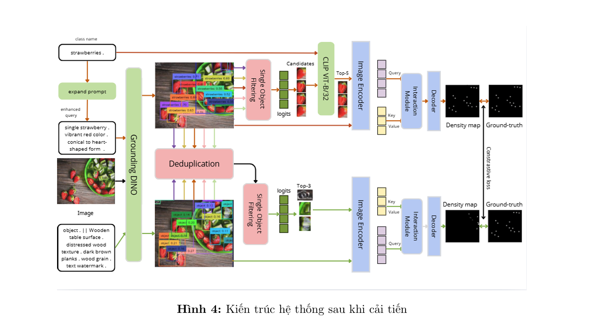
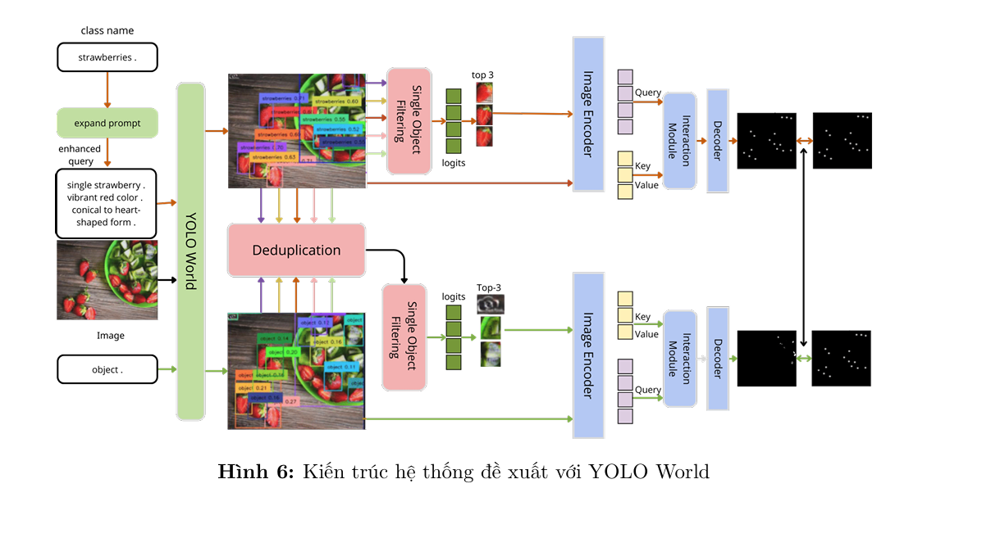

# VA-Count (Customized): Đếm đối tượng Zero-shot với Good Exemplars


---

## 1) Giới thiệu nhanh

Dự án này mở rộng từ paper **“Zero-shot Object Counting with Good Exemplars” (ECCV 2024)**.
Mục tiêu: đếm số lượng đối tượng trong ảnh bằng cách tận dụng exemplar tốt (positive/negative), kết hợp backbone ViT/MAE và cơ chế cross-attention.

Trong repo hiện tại, bạn đã bổ sung các nhánh tạo exemplar bằng:
- **Grounding DINO**
- **YOLO World**
- Có/không có prompt mô tả class

Điểm mạnh của pipeline là linh hoạt trong cách tạo annotation exemplar để fine-tune và so sánh chất lượng đếm.

---

## 2) Minh hoạ hai nhánh prompt trong repo

### Grounding DINO + Prompt


### YOLO + Prompt


---

## 3) Kiến trúc thư mục chính

```text
VA-Count/
├── data/
│   ├── FSC147/
│   │   ├── images_384_VarV2/
│   │   ├── gt_density_map_adaptive_384_VarV2/
│   │   ├── annotation_FSC147_384.json
│   │   ├── annotation_FSC147_pos*.json / neg*.json / yolo*.json
│   │   ├── Train_Test_Val_FSC_147.json
│   │   ├── train.txt, val.txt, test.txt
│   └── out/
│       ├── classify/
│       ├── results_base/
│       └── pre_4_dir/
├── GroundingDINO/                     # submodule/model cho grounding
├── util/                              # dataset loader + tiện ích
├── models_crossvit.py                 # model cross-ViT
├── models_mae_cross.py                # MAE + cross attention
├── models_mae_noct.py                 # MAE variant
├── biclassify.py                      # train binary classifier
├── datasetmake.py                     # tạo dữ liệu cho classifier
├── grounding_pos.py / grounding_neg.py
├── yolo_pos_withPrompt.py / yolo_neg.py / pos_yolo_withoutPrompt.py
├── FSC_pretrain.py                    # pretrain
├── FSC_train.py                       # fine-tune
├── FSC_test.py                        # test/eval
├── demo_app_advanced.py               # app demo
├── demo_inference.py                  # demo infer nhanh
└── inference_official.py              # script infer chuẩn
```

---

## 4) Luồng hoạt động tổng thể (để nhớ nhanh)

### 4.1 Luồng dữ liệu
1. **Input dữ liệu FSC147** (ảnh + density map + split + class text).
2. **Sinh exemplar annotation**:
   - DINO (pos/neg, có thể có prompt).
   - YOLO (pos/neg, có/không prompt).
3. **(Tuỳ chọn) Train binary classifier** để lọc/đánh giá exemplar.
4. **(Tuỳ chọn) Pretrain** backbone theo cấu hình repo.
5. **Fine-tune model đếm** bằng file annotation đã chọn.
6. **Test/Inference** để lấy MAE/RMSE hoặc kết quả trực quan.

### 4.2 Luồng train/infer theo script
- `datasetmake.py` → chuẩn bị dữ liệu classifier
- `biclassify.py` → train classifier
- `grounding_pos.py`, `grounding_neg.py` (hoặc nhánh YOLO) → sinh annotation exemplar
- `FSC_pretrain.py` (optional) → pretrain
- `FSC_train.py` → fine-tune với annotation cụ thể
- `FSC_test.py` / `demo_*` / `inference_official.py` → đánh giá và demo

> Mẹo nhớ nhanh:
> **“Chuẩn bị data → sinh exemplar → train/fine-tune → test/demo”**

---

## 5) Cài đặt môi trường

## Yêu cầu
- Python 3.8+ (khuyến nghị dùng môi trường riêng)
- CUDA tương thích với bản PyTorch bạn cài
- Git

## Cài đặt
```bash
git clone <repo-url>
cd VA-Count

conda create -n vacount python=3.12 -y
conda activate vacount

# Cài torch theo CUDA của máy (ví dụ)
pip install torch torchvision --index-url https://download.pytorch.org/whl/cu121

# Cài GroundingDINO
pip install -e ./GroundingDINO

# Cài dependencies còn lại
pip install -r requirements.txt
```

---

## 6) Chuẩn bị dữ liệu & model weights

## Dữ liệu FSC147
Đặt dữ liệu vào:
- `./data/FSC147/images_384_VarV2/`
- `./data/FSC147/gt_density_map_adaptive_384_VarV2/`
- Các file annotation/split tương ứng.

Nếu chưa có `train.txt/val.txt/test.txt`, tạo từ `Train_Test_Val_FSC_147.json` (theo logic script cũ).

## Weights cần thiết
- Grounding DINO weights: `GroundingDINO/weights/groundingdino_swint_ogc.pth`
- Checkpoint đếm (`checkpoint_FSC.pth` hoặc checkpoint bạn fine-tune)
- MAE pretrain weights (nếu dùng pretrain/fine-tune từ đầu)

---

## 7) Quick Start (chạy nhanh)

## A. Test nhanh mô hình đếm
```bash
python FSC_test.py \
  --output_dir ./data/out/results_base \
  --resume ./data/checkpoint_FSC.pth \
  --data_path ./data/FSC147 \
  --split test
```

## B. Chạy demo app
```bash
python demo_app_advanced.py \
  --resume ./data/checkpoint_FSC.pth \
  --data_path ./data/FSC147 \
  --output_dir ./demo_outputs \
  --visualize
```

> Lưu ý: trong README cũ có typo `demp_app_advaced.py`; file đúng trong repo là `demo_app_advanced.py`.

---

## 8) Quy trình train đầy đủ (tham khảo)

## Bước 1: Tạo dữ liệu classifier (optional)
```bash
python datasetmake.py --data_path ./data/FSC147
python biclassify.py --data_path ./data/FSC147 --output_dir ./data/out/classify --epochs 100
```

## Bước 2: Sinh exemplar annotation
### Nhánh DINO
```bash
python grounding_pos.py --root_path ./data/FSC147/
python grounding_neg.py --root_path ./data/FSC147/
```

### Nhánh YOLO
```bash
python yolo_pos_withPrompt.py --root_path ./data/FSC147/
python pos_yolo_withoutPrompt.py --root_path ./data/FSC147/
python yolo_neg.py --root_path ./data/FSC147/
```

## Bước 3: Pretrain (optional)
```bash
python FSC_pretrain.py \
  --data_path ./data/FSC147 \
  --output_dir ./data/out/pre_4_dir \
  --resume ./weights/mae_pretrain_vit_base_full.pth \
  --epochs 300 --batch_size 8 --lr 1e-4
```

## Bước 4: Fine-tune
```bash
python FSC_train.py \
  --data_path ./data/FSC147 \
  --anno_file annotation_FSC147_pos.json \
  --output_dir ./data/out/finetune_pos \
  --resume ./data/out/pre_4_dir/checkpoint-latest.pth \
  --epochs 500 --batch_size 8 --lr 1e-5
```

Bạn có thể đổi `--anno_file` để so sánh các biến thể:
- `annotation_FSC147_pos.json`
- `annotation_FSC147_pos_prompt.json`
- `annotation_FSC147_neg*.json`
- `annotation_FSC147_*yolo*.json`

---

## 9) So sánh nhanh các nhánh annotation (gợi ý thực nghiệm)

- **DINO + prompt**: thường semantic tốt hơn khi class khó mô tả bằng box đơn thuần.
- **YOLO + prompt**: tốc độ/độ ổn định tốt ở vài lớp phổ biến.
- **YOLO không prompt**: baseline để thấy mức đóng góp của prompt.

Nên cố định seed + split + checkpoint khởi tạo khi benchmark để so sánh công bằng.

---

## 10) Lỗi thường gặp

- **Không load được GroundingDINO**: kiểm tra `pip install -e ./GroundingDINO` và file weights.
- **Sai đường dẫn data**: kiểm tra `--data_path` và tên thư mục FSC147.
- **Thiếu checkpoint**: kiểm tra `--resume` trỏ đúng file `.pth`.
- **CUDA mismatch**: cài lại torch đúng phiên bản CUDA driver.

---

## 11) Citation

```bibtex
@inproceedings{zhu2024zero,
  title={Zero-shot Object Counting with Good Exemplars},
  author={Zhu, Huilin and Yuan, Jingling and Yang, Zhengwei and Guo, Yu and Wang, Zheng and Zhong, Xian and He, Shengfeng},
  booktitle={Proceedings of the European Conference on Computer Vision},
  year={2024}
}
```

---

## 12) Acknowledgement

- [CounTR](https://github.com/Verg-Avesta/CounTR)
- [GroundingDINO](https://github.com/IDEA-Research/GroundingDINO)
- [MAE](https://github.com/facebookresearch/mae)

---

## 13) License

MIT License. Xem file [LICENSE](LICENSE).